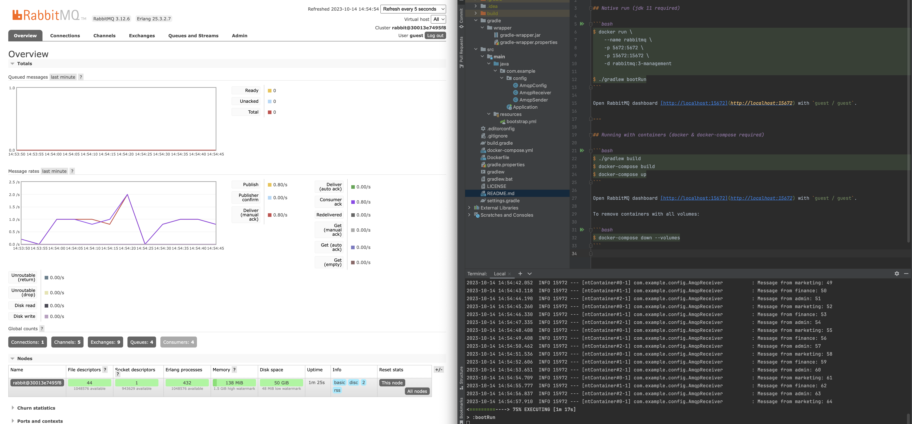

# Java-Spring-RabbitMQ-Example

## Native run (jdk 11 required)

```bash
$ docker run \
    --name rabbitmq \
    -p 5672:5672 \
    -p 15672:15672 \
    -d rabbitmq:3-management

$ ./gradlew bootRun
```

Open RabbitMQ dashboard [http://localhost:15672](http://localhost:15672) with `guest / guest`.

---

## Running with containers (docker & docker-compose required)

```bash
$ ./gradlew build
$ docker-compose build
$ docker-compose up
```

Open RabbitMQ dashboard [http://localhost:15672](http://localhost:15672) with `guest / guest`.

To remove containers with all volumes:

```bash
$ docker-compose down --volumes
```


